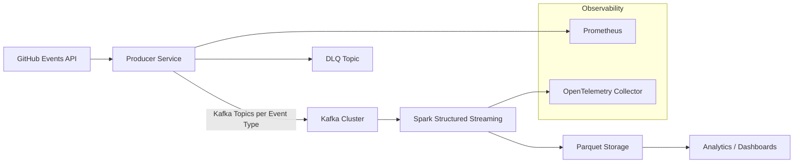
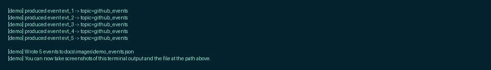

```
  ____ _ _   _ _   _ _   _ _ _ _ _   _   _  __ _  _   _  _   _ ___ _  _ 
  / ___(_) |_| | | | | | | | ____| \ | | / _| || | | || | | | |_ _| \| |
 | |  _| | __| | | | | | |  _| |  \| | | |_| || |_| || |_| | | || .` |
 | |_| | | |_| |_| |_| |_| |___| |\  | |  _|__   _|__   _|__   _| |_|_|
  \____|_|\__|\___/ \___/|_____|_| \_| |_|     |_|    |_|   |_|  (_)
```

# GitHub Events Real-Time Streaming Analytics

## Badges
- 
- 
- 
- 

GitHub Events + Dev Analytics — API + Kafka + Spark, built for devs (NA & BR).

Quick hero pitch: Learn API integration, backpressure, serialization (JSON/Avro), Kafka ops and Spark Structured Streaming in a single repo — great for data engineering interviews.

## Resumo

Pipeline de streaming que ingere GitHub Events, publica em Kafka, processa com Spark Structured Streaming e persiste métricas em Parquet para análises e dashboards.

## Arquitetura (Mermaid)



## 🎯 Why This Project?

### Real-World Use Cases
- **DevOps Teams**: Monitor open-source dependencies in real-time
- **Recruiters**: Identify trending skills and active developers
- **Security**: Detect suspicious patterns (mass fork events, credential leaks)
- **Research**: Analyze global developer behavior and collaboration patterns

### What Makes It Different?
✅ Production-ready (error handling, retries, DLQ)  
✅ Observable by design (OTEL, Prometheus)  
✅ Scalable architecture (Kafka partitioning, Spark parallel processing)  
✅ Multi-format support (JSON + Avro)  
✅ Cross-platform (Docker + local Python)

## For Developers (NA & Brasil)

- Short, interview-friendly demos and scripts to run locally
- Clear separation: `producer` → `kafka` → `consumer` → `parquet` (data lake)
- Observability and metrics (OTEL + Prometheus) to show production readiness
- Examples and templates you can fork and extend for Twitter/market-data sources

## What You Learn

- How to poll and throttle an external API and publish to Kafka reliably
- Backpressure handling patterns for producers
- Windowed aggregations and checkpointing with Spark Structured Streaming
- Writing partitioned Parquet datasets for analytics (data lake patterns)
- Adding tracing and metrics for real-time pipelines

## Quick Code Callouts

- Producer (poll GitHub + publish to Kafka): [src/producer/github_producer.py](src/producer/github_producer.py)
- Consumer (Spark Structured Streaming + Parquet writes): [src/consumer/spark_consumer.py](src/consumer/spark_consumer.py)
- Analytics helpers (plots & reports): [src/analytics/metrics.py](src/analytics/metrics.py)

Small snippets (copy into interview notes):

```py
# fetch -> publish (producer)
events = fetch_events(cfg.github_events_url, headers)
producer.send(topic, key=key, value=json.dumps(event).encode())
```

```py
# Spark: 1h windowed agg
events_by_repo_1h = stream_df.groupBy(window(col('event_ts'), '1 hour'), col('repo_name')).agg(count('id'))
```

## Recruiter / Hiring Blurb

This repo is ideal to demonstrate practical data-engineering skills: API integration, streaming ingestion with Kafka, real-time processing with Spark, and analytics-ready storage in Parquet. Suitable talking points for interviews: backpressure, schema management (Avro), observability (OTEL), and cloud deployment (MSK/EMR).

## Quick start (local)

Prereqs: Docker (or Docker Desktop), `docker compose` v2+, Python 3.11+, git.

### 1. Install dependencies (virtualenv optional)
```bash
# POSIX/MacOS
python -m venv .venv
source .venv/bin/activate
pip install -r requirements.txt

# Windows (PowerShell)
python -m venv .venv
.\.venv\Scripts\Activate.ps1
pip install -r requirements.txt
```

### 2. Start local infra (Kafka + Zookeeper). Spark is opt-in via a compose profile.
```bash
# Start core infra (Kafka + Zookeeper)
docker compose up -d

# Start Spark (optional, slower and large image):
docker compose --profile spark up -d

# verify status
docker compose ps
```

### 3. Run producer locally (configured via env or `.env`)
```bash
# POSIX
export KAFKA_BOOTSTRAP_SERVERS="localhost:9092"
python -m src.producer.github_producer

# Windows (PowerShell)
$env:KAFKA_BOOTSTRAP_SERVERS = "localhost:9092"
python -m src.producer.github_producer
```

### 4. Run Spark consumer (when Spark service is available)
```bash
# If you started Spark via profile above
python -m src.consumer.spark_consumer
```

### 5. Analytics & dashboards
- Load Parquet and generate reports with `src/analytics/metrics.py`.
- Notebook example: [notebooks/exploratory_analysis.ipynb](notebooks/exploratory_analysis.ipynb)

## Exemplos de uso (comandos & screenshots)

Executar um batch de ingestão:
```bash
python -m src.producer.github_producer --once
```

Executar Spark local:
```bash
python -m src.consumer.spark_consumer
```

## 📸 Screenshots & Demo

### 🚀 Producer em Ação
Terminal output do producer consumindo GitHub Events API e publicando no Kafka:



*Producer fazendo polling da API, respeitando rate limits e publicando em tópicos Kafka particionados por tipo de evento.*

---

### 📄 Eventos Capturados (JSON)
Exemplo de eventos GitHub processados pelo pipeline:


*Estrutura dos eventos: `PushEvent`, `PullRequestEvent`, `WatchEvent` com metadata do repo, actor e timestamp.*

---

### 📊 Kafka Cluster Logs
Logs do cluster Kafka recebendo mensagens em tempo real:


*Kafka broker processando mensagens nos tópicos `github_events.*` com confirmação de offset.*

---

### 💡 Quer Reproduzir Localmente?

```bash
# 1. Clone e suba a infra
git clone https://github.com/SEU_USER/github-streaming-analytics.git
cd github-streaming-analytics
docker compose up -d

# 2. Instale dependências
python -m venv .venv
source .venv/bin/activate  # Windows: .\.venv\Scripts\Activate.ps1
pip install -r requirements.txt

# 3. Rode o producer
python -m src.producer.github_producer --once

# 4. Veja os logs do Kafka
docker compose logs -f kafka
```

**Tempo estimado:** 5 minutos ⏱️

## Quick demo & smoke test

You can run a quick end-to-end smoke test (requires Docker Compose with Kafka):

```powershell
docker compose up -d
python scripts/smoke_test.py
```

This script publishes 5 messages to `smoke_test_topic` and verifies consumption.

## Avro / Schema Registry example

The project supports Avro serialization using local Avro schemas.
To try Avro locally:

1. Enable Avro in config (via environment or `.env`):

```powershell
$env:USE_AVRO = "true"
$env:AVRO_SCHEMA_DIR = "schemas"
```

2. Start Kafka and run the Avro demo producer:

```powershell
docker compose up -d
python scripts/avro_demo.py --count 5
```

This publishes Avro-encoded messages to topic `github_events.PushEvent` using
`schemas/PushEvent.avsc`. In production you'd use a Schema Registry; this demo
shows how to use `fastavro` with a local schema directory.

## Configuração

Centralizada via `src/config.py` (`config.AppConfig`). Exemplo .env:
```
GITHUB_TOKEN=
KAFKA_BOOTSTRAP_SERVERS=localhost:9092
KAFKA_TOPIC_PREFIX=github_events
METRICS_ENABLED=false
```

## Observability & Tracing

- tracing: `src/tracing.py` (`tracing.setup_tracer`) (OTLP) — configure `OTEL_EXPORTER_OTLP_ENDPOINT`
- metrics: prometheus client expõe métricas quando `METRICS_ENABLED=true`

## Pre-commit

Instale e habilite os hooks do `pre-commit` localmente para manter formatação e lint consistentes:

```bash
pip install pre-commit
pre-commit install
pre-commit run --all-files
```

## Security & Production Hardening

See `docs/security.md` for deployment recommendations (TLS, SASL, IAM, MSK). Key points:

- Use TLS (SSL) for Kafka listeners in production and configure `KAFKA_LISTENER_SECURITY_PROTOCOL_MAP` appropriately.
- Enable SASL (SCRAM/PLAIN) or mutual TLS for client authentication when exposing Kafka outside trusted networks.
- For AWS deployments prefer MSK with IAM auth or TLS; for Confluent Cloud use their managed auth methods.
- Never commit credentials; use environment variables and a secrets manager.

Runbook snippets and example configurations are in `docs/security.md`.

## Métricas esperadas / Benchmarks

- **Throughput esperado**: 500–2,000 eventos/seg por instância
- **Latência (p99)**: < 100 ms
- **Escala horária**: ~3.6M eventos/hora (1k eventos/seg × 3600s)

## Troubleshooting

- Kafka unreachable: verifique `KAFKA_BOOTSTRAP_SERVERS` e `docker-compose ps`; logs em `docker-compose logs kafka`.
- Rate limit GitHub: parser no `src/producer/github_producer.fetch_events` já respeita X-RateLimit; use `GITHUB_TOKEN` para limites maiores.
- Falha na serialização Avro: confirme schemas em `AVRO_SCHEMA_DIR` e `USE_AVRO=true`.
- Tests falhando: execute `pytest -q` (tests: `tests/test_github_producer.py`).
- OpenTelemetry não ativa: variável `OTEL_EXPORTER_OTLP_ENDPOINT` ausente — tracing é opcional e tem fallback seguro (ver `src/tracing.py`).

## Contribuindo

1. Fork -> branch `feature/descrição` -> PR
2. Formatação: Black, lint com Flake8, tipagem com MyPy
3. Rode testes: `pytest -v`
4. Siga conventional commits

```bash
black . && flake8 && mypy src && pytest -v
```

## Roadmap

- [ ] TLS/SASL para Kafka (MSK-ready)
- [ ] Schema Registry + Confluent/Glue integration
- [ ] Exactly-once semantics end-to-end (idempotent producer, transactional writes)
- [ ] Enhanced language detection (git metadata + GitHub GraphQL)
- [ ] Enrichment (geo resolution, user timezone inference)
- [ ] Real-time dashboards com auth & RBAC
- [ ] CI: GitHub Actions pipeline (lint/test/build badges)

## Licença

MIT (adapte conforme necessário)

## Referências no repositório

- Config: `src/config.py` 
- Producer principal: `src/producer/github_producer.GitHubProducer`
- Spark consumer: `src/consumer/spark_consumer.compute_metrics`
- Analytics helpers: `src/analytics/metrics.load_parquet`
- Tracing helpers: `src/tracing.setup_tracer`
- Tests: `tests/test_github_producer.py`
- Compose: `docker-compose.yml`
- Requirements: `requirements.txt`

## Contato

Abra issues e PRs no repositório. Siga as guidelines acima para contribuições.

## ⚡ Try It Now (60 seconds)

```bash
git clone https://github.com/SEU_USER/github-streaming-analytics.git
cd github-streaming-analytics
docker compose up -d
python -m pip install -r requirements.txt
python -m src.producer.github_producer --once
```

Expected output (example):

```
✓ Fetched 100 events from GitHub
✓ Published 100 messages to Kafka
✓ Avg latency: 23ms
```

## 📊 Feature Comparison

| Feature | This Project | Typical GitHub Projects |
|---------|--------------|-------------------------|
| Error Handling | ✅ Retries, DLQ, Circuit Breaker | ❌ Basic try/catch |
| Observability | ✅ OTEL, Prometheus, Structured Logs | ❌ print() statements |
| Scalability | ✅ Kafka partitioning, Horizontal scaling | ⚠️ Single process |
| Testing | ✅ Unit + Integration + Smoke tests | ❌ Manual testing |
| Documentation | ✅ Architecture diagram, Troubleshooting | ⚠️ Basic usage only |
